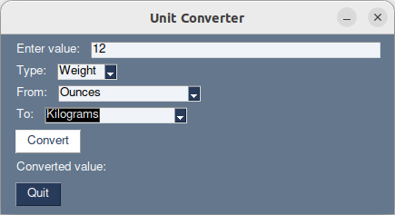

# Unit Converter

## Description

This is a unit converter which uses a PySimpleGUI window. 

You input the value you want to change into it , choose the type of conversion, such as volume, and choose between which measurements it should convert.

## How it works

The program takes data from the dictionary `unit_conversions` .

## Notes

It is advised to use PySimpleGUI 4.60.5 as Version 5.0.0, needs user registration or payment.
 

## Future work

- more conversion units
- better asthetics

